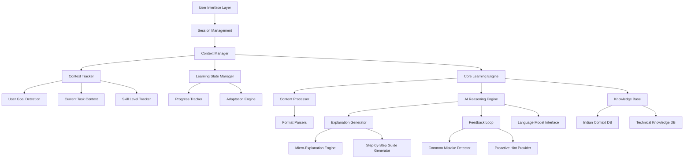
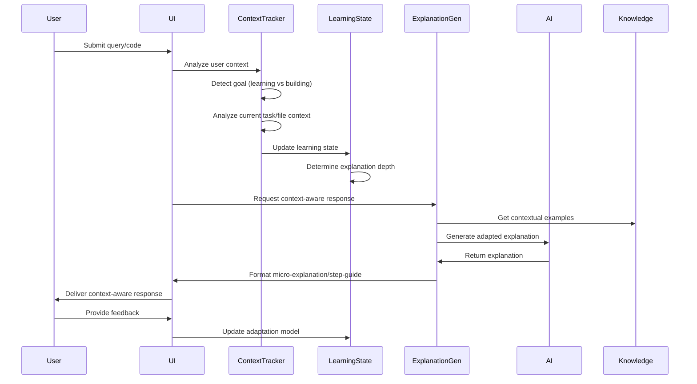

# Design Document: TechSaarthi AI

## Overview

TechSaarthi AI is a conversational system that leverages large language models to provide personalized learning support for students and developers in India. The system processes various content formats (text, code, documentation) and delivers structured explanations, guided learning paths, and productivity assistance tailored to Indian educational and professional contexts.

The core innovation is the **Context-Aware Learning & Builder Guide** - an intelligent system that adapts explanations based on user goals (learning vs building), current task context, skill level, and learning progress. This ensures users receive micro-explanations when learning and step-by-step guidance when building, with proactive hints and mistake detection.

The architecture follows a modular design with clear separation between content processing, AI reasoning, context management, and user interaction layers. This enables scalable deployment and easy integration of new learning modalities while maintaining hackathon-appropriate simplicity.

## Architecture

The system employs a layered architecture with the following key components, enhanced with context-aware learning capabilities:



**Enhanced Layer Responsibilities:**
- **User Interface Layer**: Handles user interactions and context-aware response formatting
- **Session Management**: Maintains conversation state, user progress, and learning context
- **Context Manager**: Orchestrates context tracking and learning state management
- **Context Tracker**: Monitors user goals, current tasks, and skill progression
- **Learning State Manager**: Manages adaptive learning state and explanation depth
- **Core Learning Engine**: Orchestrates learning workflows with context-aware decision-making
- **Content Processor**: Analyzes input content with context awareness
- **AI Reasoning Engine**: Enhanced with explanation generation and feedback loops
- **Knowledge Base**: Stores contextual information and learning resources

## Components and Interfaces

### 1. Content Processor

**Purpose**: Analyzes and structures various input formats for learning assistance.

**Key Classes:**
- `ContentAnalyzer`: Main interface for content processing
- `CodebaseAnalyzer`: Specialized for source code analysis
- `DocumentationProcessor`: Handles technical documentation
- `ConceptExtractor`: Identifies key technical concepts

**Interfaces:**
```typescript
interface ContentAnalyzer {
  analyzeContent(content: string, format: ContentFormat): AnalysisResult
  extractConcepts(content: string): TechnicalConcept[]
  identifyComplexity(content: string): ComplexityLevel
}

interface CodebaseAnalyzer extends ContentAnalyzer {
  analyzeStructure(codebase: Codebase): ArchitectureInsight[]
  identifyPatterns(code: string): DesignPattern[]
  suggestImprovements(code: string): CodeSuggestion[]
}
```

### 2. AI Reasoning Engine

**Purpose**: Provides intelligent responses using language models with educational focus.

**Key Classes:**
- `LearningOrchestrator`: Coordinates AI responses for learning scenarios
- `ExplanationGenerator`: Creates structured explanations
- `QuestionHandler`: Processes follow-up questions and clarifications
- `ContextualAdapter`: Adapts responses to Indian context

**Interfaces:**
```typescript
interface LearningOrchestrator {
  generateExplanation(concept: TechnicalConcept, userLevel: ExperienceLevel): Explanation
  createLearningPath(goal: LearningGoal, background: UserBackground): LearningPath
  handleFollowUp(question: string, context: ConversationContext): Response
}

interface ExplanationGenerator {
  simplifyTechnicalConcept(concept: TechnicalConcept): SimplifiedExplanation
  generateExamples(concept: TechnicalConcept, context: IndianContext): Example[]
  adaptComplexity(explanation: Explanation, targetLevel: ExperienceLevel): Explanation
}
```

### 3. Context-Aware Learning Components

**Purpose**: Implements the core context-aware learning and builder guide functionality.

**Key Classes:**
- `ContextTracker`: Monitors user goals, current tasks, and skill level
- `LearningStateManager`: Manages adaptive learning state and explanation depth
- `ExplanationGenerator`: Creates context-aware micro-explanations and step-by-step guides
- `FeedbackLoop`: Provides mistake detection and proactive hints

**Interfaces:**
```typescript
interface ContextTracker {
  detectUserGoal(interaction: UserInteraction): UserGoal
  analyzeCurrentTask(codeContext: CodeContext, fileContext: FileContext): TaskContext
  trackSkillProgression(topic: string, performance: PerformanceMetrics): SkillLevel
  updateContext(newContext: ContextUpdate): void
}

interface LearningStateManager {
  adaptExplanationDepth(currentLevel: SkillLevel, topic: TechnicalConcept): ExplanationDepth
  manageProgressState(userId: string, topic: string): LearningProgress
  determineNextSteps(currentState: LearningState): NextAction[]
}

interface ExplanationGenerator {
  generateMicroExplanation(concept: TechnicalConcept, context: UserContext): MicroExplanation
  createStepByStepGuide(task: BuildingTask, context: ProjectContext): StepGuide
  adaptToUserMode(explanation: Explanation, mode: UserMode): AdaptedExplanation
}

interface FeedbackLoop {
  detectCommonMistakes(userInput: string, context: TaskContext): Mistake[]
  generateProactiveHints(currentTask: Task, userProgress: Progress): Hint[]
  collectAdaptationFeedback(response: Response, userReaction: Reaction): FeedbackData
}
```

### 4. Enhanced Context Manager

**Purpose**: Maintains learning context and personalizes experiences.

**Key Classes:**
- `SessionTracker`: Tracks conversation state and progress
- `UserProfileManager`: Manages user background and preferences
- `ProgressTracker`: Monitors learning advancement
- `IndianContextProvider`: Provides culturally relevant context

**Interfaces:**
```typescript
interface SessionTracker {
  updateContext(interaction: UserInteraction): void
  getRelevantContext(query: string): ConversationContext
  trackProgress(topic: string, understanding: UnderstandingLevel): void
}

interface UserProfileManager {
  getUserBackground(): UserBackground
  updateExperienceLevel(domain: string, level: ExperienceLevel): void
  getPreferences(): UserPreferences
}
```

### 4. Enhanced Context Manager

**Purpose**: Maintains learning context and personalizes experiences with context-aware capabilities.

**Key Classes:**
- `SessionTracker`: Tracks conversation state, progress, and context transitions
- `UserProfileManager`: Manages user background, preferences, and skill evolution
- `ProgressTracker`: Monitors learning advancement with context awareness
- `IndianContextProvider`: Provides culturally relevant context and examples

**Interfaces:**
```typescript
interface SessionTracker {
  updateContext(interaction: UserInteraction): void
  getRelevantContext(query: string): ConversationContext
  trackProgress(topic: string, understanding: UnderstandingLevel): void
  detectContextTransition(previousMode: UserMode, currentMode: UserMode): ContextTransition
}

interface UserProfileManager {
  getUserBackground(): UserBackground
  updateExperienceLevel(domain: string, level: ExperienceLevel): void
  getPreferences(): UserPreferences
  trackSkillEvolution(skillMetrics: SkillMetrics): void
}
```

### 5. Knowledge Base

**Purpose**: Stores and retrieves contextual information for enhanced responses.

**Key Classes:**
- `TechnicalKnowledgeDB`: Technical concepts and explanations
- `IndianContextDB`: Indian-specific examples and career information
- `LearningResourceDB`: Curated learning materials and paths
- `CodePatternDB`: Common code patterns and best practices
- `ContextualExampleDB`: Context-aware examples and explanations

**Interfaces:**
```typescript
interface TechnicalKnowledgeDB {
  getConcept(conceptId: string): TechnicalConcept
  getPrerequisites(concept: TechnicalConcept): TechnicalConcept[]
  getRelatedConcepts(concept: TechnicalConcept): TechnicalConcept[]
  getMicroExplanations(concept: TechnicalConcept, depth: ExplanationDepth): MicroExplanation[]
}

interface IndianContextDB {
  getRelevantExamples(concept: TechnicalConcept): IndianExample[]
  getCareerPaths(domain: string): CareerPath[]
  getLocalCompanyContext(): CompanyContext[]
}

interface ContextualExampleDB {
  getContextualExamples(concept: TechnicalConcept, userContext: UserContext): ContextualExample[]
  getStepByStepGuides(task: BuildingTask, skillLevel: SkillLevel): StepGuide[]
}
```

## Data Flow with Context Awareness

The enhanced data flow demonstrates how user context influences AI responses:



## Data Models

### Core Learning Models

```typescript
interface TechnicalConcept {
  id: string
  name: string
  description: string
  complexity: ComplexityLevel
  prerequisites: string[]
  domain: TechnicalDomain
  examples: Example[]
  microExplanations: MicroExplanation[]
}

interface LearningPath {
  id: string
  goal: LearningGoal
  milestones: Milestone[]
  estimatedDuration: Duration
  difficulty: DifficultyLevel
  indianContext: IndianCareerRelevance
  contextualAdaptations: ContextualAdaptation[]
}

interface Explanation {
  concept: TechnicalConcept
  simplifiedDescription: string
  examples: Example[]
  practicalApplications: Application[]
  nextSteps: string[]
  explanationDepth: ExplanationDepth
  contextualRelevance: ContextualRelevance
}
```

### Context-Aware Models

```typescript
interface UserContext {
  currentGoal: UserGoal // learning | building | debugging
  taskContext: TaskContext
  skillLevel: SkillLevel
  learningProgress: LearningProgress
  preferredDepth: ExplanationDepth
}

interface TaskContext {
  currentFile: FileContext
  projectStructure: ProjectStructure
  recentActions: UserAction[]
  identifiedChallenges: Challenge[]
}

interface MicroExplanation {
  concept: TechnicalConcept
  briefDescription: string // 1-2 sentences max
  keyPoint: string
  quickExample: string
  contextualRelevance: number
}

interface StepGuide {
  task: BuildingTask
  steps: Step[]
  contextualHints: Hint[]
  commonMistakes: Mistake[]
  nextActions: NextAction[]
}

interface ExplanationDepth {
  level: 'eli5' | 'beginner' | 'intermediate' | 'advanced' | 'expert'
  detailLevel: number // 1-10 scale
  exampleComplexity: ComplexityLevel
  assumedKnowledge: TechnicalConcept[]
}
```

### User and Session Models

```typescript
interface UserBackground {
  educationLevel: EducationLevel
  experienceLevel: ExperienceLevel
  technicalDomains: TechnicalDomain[]
  careerGoals: CareerGoal[]
  preferredLearningStyle: LearningStyle
  skillEvolution: SkillEvolution[]
}

interface ConversationContext {
  currentTopic: TechnicalConcept
  discussedConcepts: TechnicalConcept[]
  userQuestions: Question[]
  understandingLevel: UnderstandingLevel
  sessionGoals: LearningGoal[]
  contextTransitions: ContextTransition[]
  adaptationHistory: AdaptationEvent[]
}

interface LearningProgress {
  userId: string
  conceptsMastered: TechnicalConcept[]
  currentFocus: TechnicalConcept[]
  strugglingAreas: TechnicalConcept[]
  learningVelocity: LearningVelocity
  contextualPerformance: ContextualPerformance
}
```

### Content Analysis Models

```typescript
interface AnalysisResult {
  contentType: ContentFormat
  extractedConcepts: TechnicalConcept[]
  complexity: ComplexityLevel
  keyInsights: Insight[]
  suggestedActions: Action[]
}

interface CodebaseInsight {
  architecture: ArchitecturePattern
  technologies: Technology[]
  complexity: ComplexityMetrics
  improvementAreas: ImprovementSuggestion[]
  learningOpportunities: LearningOpportunity[]
}
```

## Correctness Properties

*A property is a characteristic or behavior that should hold true across all valid executions of a system—essentially, a formal statement about what the system should do. Properties serve as the bridge between human-readable specifications and machine-verifiable correctness guarantees.*

After analyzing all acceptance criteria, I've identified several properties that can be consolidated to eliminate redundancy while maintaining comprehensive coverage:

### Property Reflection

Several acceptance criteria test similar capabilities that can be combined:
- Properties 1.2 and 1.5 both test Indian context relevance in examples - combined into Property 1
- Properties 8.1, 8.2, 8.3, 8.5 all test Indian cultural context - combined into Property 2  
- Properties 2.1, 2.2, 2.3 all test code analysis capabilities - combined into Property 3
- Properties 3.1, 3.2, 3.3 all test documentation processing - combined into Property 4
- Properties 7.1, 7.4, 7.5 all test context-aware adaptation - combined into Property 5

### Core Correctness Properties

**Property 1: Indian Context Relevance**
*For any* technical concept explanation or example generation, all provided examples and scenarios should reference Indian technology companies, educational backgrounds, or cultural contexts relevant to Indian learners.
**Validates: Requirements 1.2, 1.5, 8.1, 8.3, 8.5**

**Property 2: Context-Aware Response Adaptation**
*For any* user interaction, the system should adapt response style, explanation depth, and content focus based on detected user context (learning vs building mode, skill level, current task).
**Validates: Requirements 7.1, 7.4, 7.5, 7.7**

**Property 3: Comprehensive Code Analysis**
*For any* provided codebase or code snippet, the analysis should identify structural components, design patterns, potential issues, and provide step-by-step explanations of complex logic.
**Validates: Requirements 2.1, 2.2, 2.3, 2.4, 2.5**

**Property 4: Documentation Processing Completeness**
*For any* technical documentation, the system should generate concise summaries that preserve critical details, organize content by priority, and extract actionable steps.
**Validates: Requirements 3.1, 3.2, 3.3, 3.4**

**Property 5: Prerequisite-Aware Learning Paths**
*For any* technical concept with prerequisites, explanations and learning paths should cover foundational topics before advanced concepts, with milestones appropriate for Indian educational backgrounds.
**Validates: Requirements 1.3, 4.1, 4.2**

**Property 6: Proactive Learning Support**
*For any* user interaction showing knowledge gaps or common mistakes, the system should provide proactive hints, alternative explanations, and gentle corrections to guide toward correct understanding.
**Validates: Requirements 5.5, 7.3, 11.3**

**Property 7: Multi-Format Context Maintenance**
*For any* learning session involving multiple content formats (text, code, documentation), the system should maintain consistent context and provide relevant connections across all formats.
**Validates: Requirements 9.1, 9.2, 9.4, 9.5**

**Property 8: Progress-Aware Recommendations**
*For any* user demonstrating learning progress or completion of topics, the system should track advancement and suggest contextually appropriate next steps, advanced topics, or practical applications.
**Validates: Requirements 4.3, 10.1, 10.2, 10.5**

**Property 9: Graceful Error Handling**
*For any* ambiguous, incomplete, or out-of-domain request, the system should provide partial assistance, ask clarifying questions, or suggest alternative resources while explaining limitations.
**Validates: Requirements 11.1, 11.2, 11.4, 11.5**

**Property 10: Interactive Learning Engagement**
*For any* explanation or response, the system should encourage active learning through relevant questions, practical exercises, and opportunities for deeper engagement with the material.
**Validates: Requirements 5.2, 5.4, 6.5**

## Error Handling

The system implements comprehensive error handling across all components:

### Input Validation
- **Content Format Validation**: Verify supported formats before processing
- **User Context Validation**: Ensure context data is complete and valid
- **Query Sanitization**: Clean and validate user inputs for security

### AI Model Error Handling
- **API Timeout Handling**: Graceful degradation when AI services are slow
- **Rate Limit Management**: Queue requests and provide user feedback
- **Model Unavailability**: Fallback to cached responses or alternative models

### Context-Aware Error Recovery
- **Context Loss Recovery**: Rebuild context from session history when needed
- **Adaptation Failure Handling**: Fall back to standard explanations when context adaptation fails
- **Progress Tracking Errors**: Maintain learning continuity despite tracking failures

### User Experience Error Handling
- **Graceful Degradation**: Provide partial functionality when components fail
- **Clear Error Communication**: Explain limitations and suggest alternatives
- **Recovery Suggestions**: Guide users toward successful interactions

## Testing Strategy

### Dual Testing Approach

The system requires both unit testing and property-based testing for comprehensive coverage:

**Unit Tests**: Focus on specific examples, edge cases, and integration points
- Context detection accuracy with known scenarios
- Indian cultural reference validation
- Error handling for specific failure modes
- Component integration testing

**Property Tests**: Verify universal properties across all inputs (minimum 100 iterations each)
- **Feature: ai-learning-assistant, Property 1**: Indian context relevance in all explanations
- **Feature: ai-learning-assistant, Property 2**: Context-aware adaptation for all user interactions
- **Feature: ai-learning-assistant, Property 3**: Comprehensive analysis for all code inputs
- **Feature: ai-learning-assistant, Property 4**: Complete documentation processing for all formats
- **Feature: ai-learning-assistant, Property 5**: Prerequisite ordering for all learning paths
- **Feature: ai-learning-assistant, Property 6**: Proactive support for all learning difficulties
- **Feature: ai-learning-assistant, Property 7**: Context maintenance across all format combinations
- **Feature: ai-learning-assistant, Property 8**: Progress-aware recommendations for all advancement scenarios
- **Feature: ai-learning-assistant, Property 9**: Graceful handling for all error conditions
- **Feature: ai-learning-assistant, Property 10**: Interactive engagement in all explanations

### Testing Framework Selection

**Property-Based Testing**: Use Hypothesis (Python) or fast-check (TypeScript) for property tests
**Unit Testing**: Use pytest (Python) or Jest (TypeScript) for specific scenarios
**Integration Testing**: Test component interactions and AI model integration
**User Experience Testing**: Validate context-aware adaptations with simulated user journeys

### Hackathon-Appropriate Testing

Given the hackathon timeline:
- **Priority 1**: Core property tests for unique features (Context-Aware Learning)
- **Priority 2**: Unit tests for critical error handling
- **Priority 3**: Integration tests for AI model interactions
- **Demo Validation**: Ensure all demo scenarios work reliably